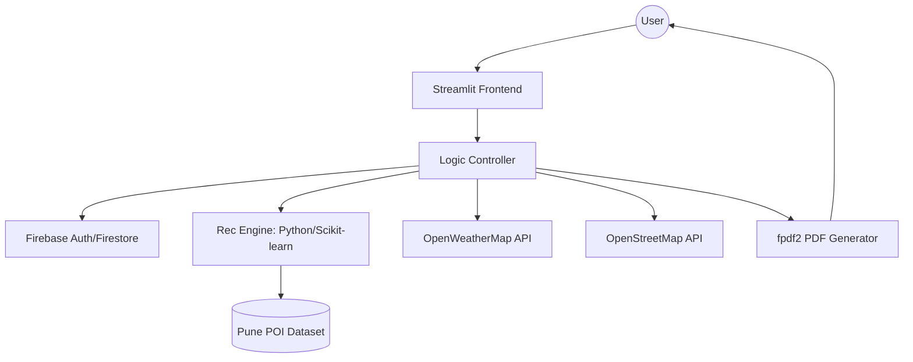

# SDLC Documentation: Puneri Pulse

## 1. Project Overview
A personalized trip planning application for the Pune region, focusing on manual logic and custom recommendation systems instead of black-box LLM APIs.

---

## 2. Requirement Analysis
### Functional Requirements
- **User Inputs**: Destination (Pune), Days (1-7), Budget (Budget, Mid, Luxury), Group Type (Solo, Friends, Family).
- **Core Engine**: Generate a sequential itinerary including morning, afternoon, and evening activities.
- **Maps**: Visualize locations on a map for better navigation.
- **Weather**: Integrated real-time weather alerts.
- **Export**: Ability to export the itinerary as a PDF.

### Non-Functional Requirements
- **Response Time**: < 2 seconds for plan generation.
- **Aesthetics**: Premium, modern dark-themed UI.
- **Scalability**: Easily add more cities (future scope).

---

## 3. System Design

### Architecture Diagram

---

## 4. Logical & Data Model

### Data Schema (Firestore)
- **Users**: `{uid, name, email, saved_trips: []}`
- **Places**: `{id, name, type, lat, lon, avg_time_spent, budget_level, rating, tags: []}`
- **Hotels**: `{id, name, lat, lon, price_category, rating}`

---

## 5. Model Training Approach (Content-Based Recommendation)

Since we are not using LLM APIs, we will build a **Recommendation System**.

### A. Data Preparation
1. **Cleaning**: Standardize coordinates and categories.
2. **Feature Engineering**: Create feature vectors for each place (e.g., `Category: Historical`, `Budget: 2`, `Family-Friendly: 1`).

### B. The Algorithm (Custom Model)
1. **Cosine Similarity**: Compare a "User Interest Vector" (constructed from their input) with "Place Vectors".
2. **Constraint Satisfaction**:
   - Filter by budget first.
   - Use **K-Means Clustering** to group places that are physically close to each other.
   - Assign clusters to "Days" (Day 1: Cluster A, Day 2: Cluster B).
3. **Sequential Routing**: Use a simple **Traveling Salesperson Problem (TSP)** heuristic (Greedy search) to order places within a day to minimize travel time.

---

## 6. Development Phases (SDLC)

| Phase | Milestone | Deliverable |
|-------|-----------|-------------|
| 1 | Planning | SDLC Doc & Implementation Plan |
| 2 | Data Engineering | Pune POI Dataset (CSV) |
| 3 | Backend | Firebase Integration & Auth |
| 4 | ML Core | Recommendation Algorithm |
| 5 | UI/UX |  Next.js 14 (React), Tailwind CSS, Framer Motion(Animations)
| 6 | Integration | PDF Export & API Connections |
| 7 | QA | Logic Verification & Load Testing |

---

## 7. How to "Train" this Model?
1. **Collect Data**: Use `overpy` (Overpass API wrapper) to download all `tourism=museum`, `amenity=cafe`, `historic=fort` from Pune.
2. **Labeling**: Manually or semi-automatically label places with "Budget" and "Group Type" tags.
3. **Validation**: Test the similarity scores. If a user likes "Forts," does the top 5 include Sinhagad, Shaniwar Wada, and Lohagad?
4. **Iterate**: Refine the weights in the scoring function based on feedback.
