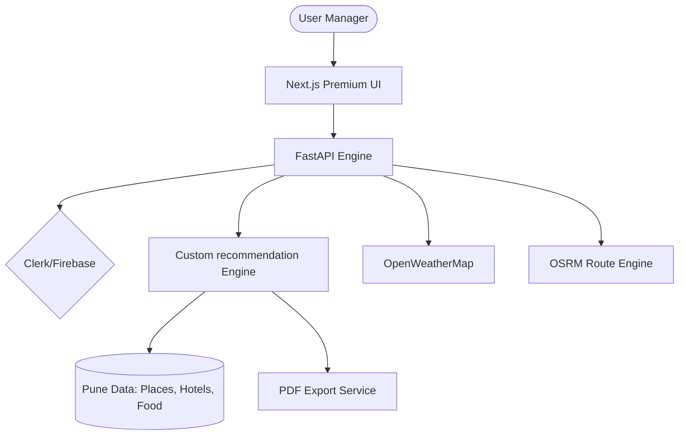

# 🚩 Master Plan: Pune AI Trip Planner (End-to-End)

This document is the **Comprehensive Roadmap** for building a premium, data-driven trip planning platform for the Pune region. It details the vision, technology, and execution steps for a professional-grade application.

---

## 1. Project Vision
**Goal**: provide a personalized, 1-7 day itinerary for Pune travelers based on budget, group type, and weather, using a custom Python-based recommendation engine (No LLM APIs).

**Target Audience**: Tourists, Solo Travelers, and Families visiting Pune.

---

## 2. System Architecture & Tech Stack

### 🛠️ The Tech Stack
- **Frontend**: Next.js 14 (React), Tailwind CSS, Framer Motion (Animations).
- **Backend**: FastAPI (Python), Pydantic (Data Validation).
- **Database**: PostgreSQL with PostGIS (Spatial queries) or MongoDB.
- **APIs**: OpenStreetMap (POIs), OpenWeatherMap (Forecast), OSRM (Routing).
- **Export**: `fpdf2` for PDF Generation.

### 🏗️ Architecture Diagram

---

## 3. Core Development Phases (SDLC)

### Phase 1: Foundation & Data Engineering 🏗️
- **Project Scaffolding**: Setup Monorepo (Frontend/Backend).
- **Data Collection**: 
    - Write `pune_scraper.py` using Overpass API (OSM).
    - Curate ~300 entries: Museums, Forts, Gardens, Restaurants, Hotels.
    - Tagging: `Budget_Level`, `Category`, `Avg_Time_Spent`, `Is_Indoor`.

### Phase 2: The "AI" Intelligence Layer 🧠
- **Algorithm**: Content-Based Filtering with Clustering.
- **Spatial Optimization**: Using the Haversine formula to group nearby spots.
- **Weather Logic**: An override function that swaps outdoor spots for indoor ones if the 5-day forecast shows rain/heatwaves.

### Phase 3: Premium UI Development ✨
- **Landing Page**: High-impact hero section with Pune's landscape.
- **Input Page**: Smooth, multi-step form for user parameters.
- **Dashboard**:
    - **Timeline View**: Hour-by-hour itinerary.
    - **Map View**: Interactive path with polylines.
    - **Weather Widget**: Real-time Pune alerts.

### Phase 4: Integration & Features 🔗
- **Map Navigation**: Real-time routing between points.
- **Hotel/Food Recs**: Location-aware suggestions for every meal.
- **PDF Generation**: Generate a visual, printable summary of the trip.

### Phase 5: Testing & Deployment 🚀
- **QA**: Load balancing, logic testing for overlapping times.
- **Deployment**:
    - Frontend: Vercel.
    - Backend: Render/Heroku (with Docker).
    - Database: Neon PostgreSQL or MongoDB Atlas.

---

## 4. Database Schema Preview (Draft)

- **`Places` Table**:
    - `id`: UUID
    - `name`: String
    - `category`: [Historical, Nature, Food, etc.]
    - `coordinates`: Geometry(Point)
    - `opening_hours`: String (OSM Format)
    - `popularity_score`: Integer (1-100)
    - `is_indoor`: Boolean

---

## 5. Key Milestones for Your Team
1.  **Milestone 1**: Successful scrape of 100+ Pune locations with coordinates.
2.  **Milestone 2**: API returning a valid JSON itinerary for a 3-day trip.
3.  **Milestone 3**: Interactive map displaying the route between Sinhagad and Shaniwar Wada.
4.  **Milestone 4**: Final export of a PDF itinerary.

---

## 6. Open Questions for Final Approval
- **Design Style**: Should we lead with a "Heritage/Historical" theme or a "Modern/Nightlife" theme?
- **Auth**: Are we using **Clerk** (Recommended for speed) or **Firebase Auth**?
- **Hosting**: Do you have existing accounts on Vercel or AWS for deployment?

---

> [!IMPORTANT]
> **Action Item**: Once approved, I will begin by generating the **Backend Boilerplate** and the **Pune Data Scraper**.
